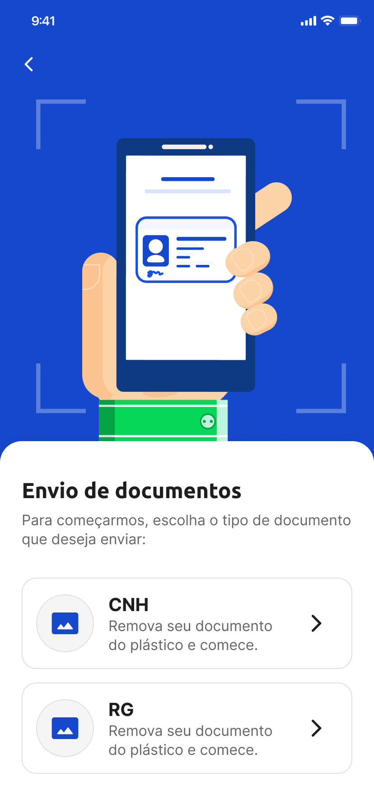
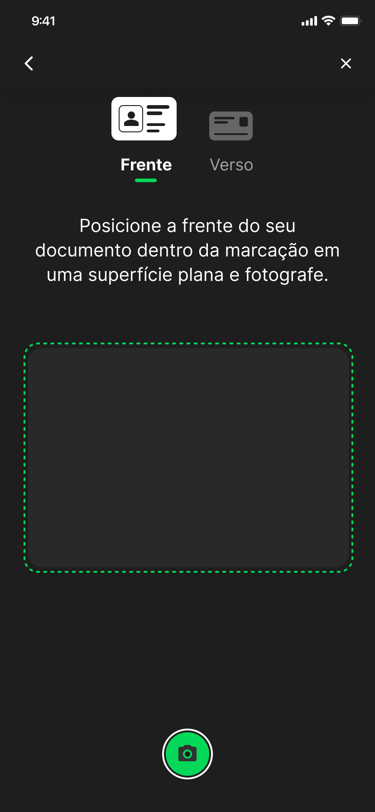
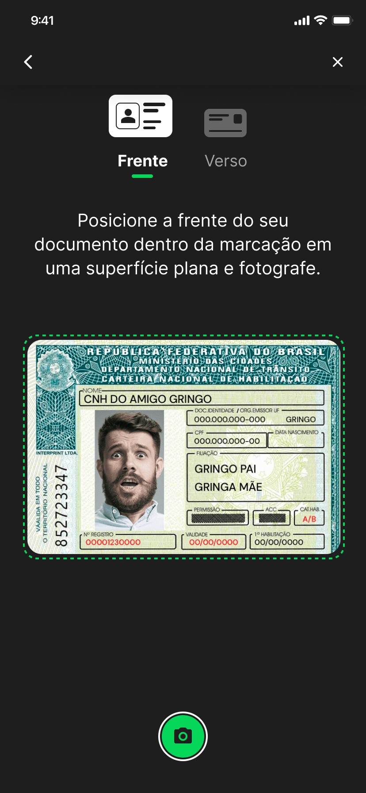
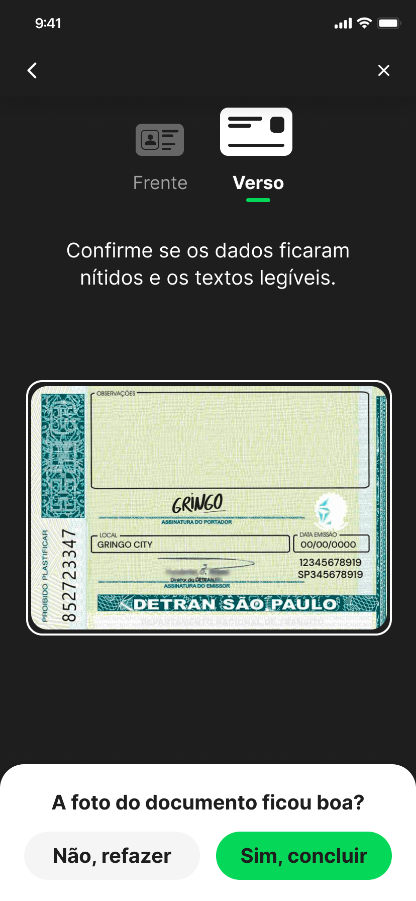
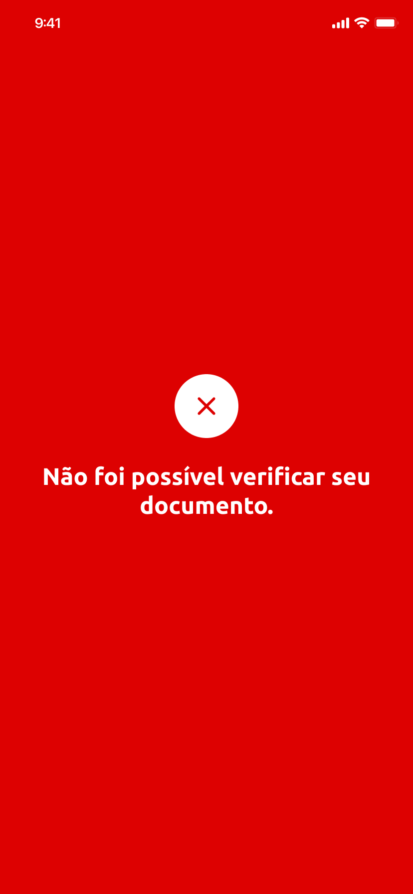
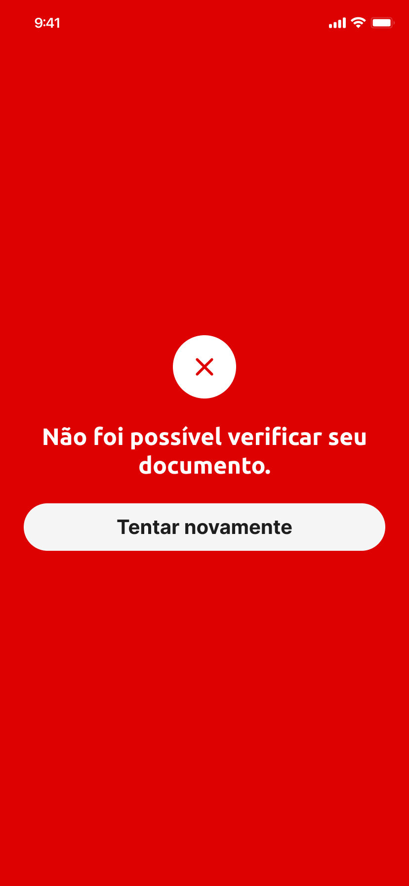
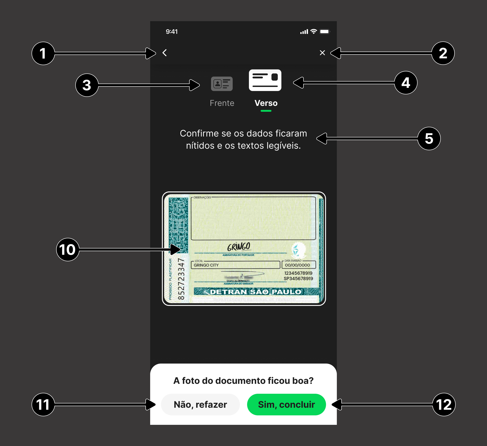

# Documentoscopia 
Saiba como implementar a customização de view (telas), conforme a sua necessidade.

Você pode utilizar o SDK padrão e por meio dele, também customizar a visualização dessas telas.

## Entenda como funciona

O processo de Documentoscopia possui as seguintes telas:

### 1. Tela inicial
O usuário define qual o tipo de documento que deseja enviar:

### 2. Tela de captura do documento (frente)
O usuário recebe a instrução de captura da frente do documento, dentro da marcação apresentada:

### 3. Abaixo, um exemplo de como esse documento deve ficar posicionado

### 4. Tela de confirmação da captura do documento (frente)
Nesta tela, o usuário deve confirmar se a imagem do documento capturado está em boa qualidade, clicando em Não, refazer ou Sim:

### 5. Tela de captura do documento (verso)
O usuário recebe a instrução de captura do verso do documento, dentro da marcação apresentada:

### 6. Abaixo, um exemplo de como esse documento deve ficar posicionado

### 7. Tela de confirmação da captura do documento (verso)
Nesta tela, o usuário deve confirmar se a imagem do documento capturado está em boa qualidade, clicando em Não, refazer ou Sim:

### 8. Tela de conclusão do envio do documento (sucesso)
O usuário receberá uma notificação de **sucesso** caso o envio do documento seja concluído com sucesso:

### 9. Tela de processamento do documento (erro)
O usuário receberá uma notificação de erro ao processar o documento:

### 10. Tela para tentar processar o documento novamente (erro)
Nesta tela o usuário poderá clicar no botão **Tentar novamente**, após a mensagem de erro:

---

## Instalação e configuração das telas customizáveis

De forma semelhante ao Liveness, a customização das views é realizada por meio da implementação dos layouts (XMLs), os quais devem obrigatoriamente conter alguns elementos visuais com IDs pré-determinados, para o funcionamento correto do processo de documentoscopia. 

A diferença é que, neste caso, deve-se implementar três layouts, sendo um para cada tela citada abaixo.

O componente de Documentoscopia é dividido em três etapas: 

#### Tela inicial 
- Onde o usuário deve escolhar se irá capturar foto da CNH ou do RG, ambas com frente e verso 

#### Tela de captura do documento
- Onde o usuário irá fotografar o documento. 

#### Tela de feedback 
- Onde o usuário irá visualizar o retorno pós processamento do documento seja positivo, negativo ou retentativa.

## Implementação

> **Nota: [Clique aqui](https://github.com/oititec/liveness-android-sdk/blob/main/Documentation/Documentscopy-Usage.md) para visualizar um exemplo de implementação.**

## Tela Inicial  

**DocumentscopyActivity.PARAM_CUSTOM_HOME_FRAGMENT**

Elementos obrigatórios:

| **Indice** | **Elemento** | **Descrição** |
|:-----------|:-------------|:--------------|
| (**1**) | `contentView` |  |
| (**2**) | `backButton` | Botão para função voltar da navegação. |
| (**3**) | `cnhPictureButton` | View que terá a ação de iniciar o fluxo de captura do documento CNH. |
| (**4**) | `rgPictureButton` | View que terá a ação de iniciar o fluxo de captura do documento RG. |

## Tela de captura das imagens  

**DocumentscopyActivity.PARAM_CUSTOM_CAMERA_FRAGMENT**

Elementos obrigatórios:

| **Indice** | **Elemento** | **Descrição** |
|:-----------|:-------------|:--------------|
| (**1**) | `backButton` | Button para voltar de tela. |
| (**2**) | `closeButton` | Button para fechar a tela. |
| (**3**) | `checkFront` | RadioButton que é ativado quando o usuário está tirando foto da frente do documento. |
| (**4**) | `checkBack` | RadioButton que é ativado quando o usuário está tirando foto do verso do documento. |
| (**5**) | `instructionsTextView` | Texto de orientação que será exibido ao usuário |
| (**6**) | `cameraFrameLayout` | Nesta view será colocado o preview da câmera. |
| (**7**) | `cameraFrameBorder` | View que determina onde a borda da câmera estará visível. |
| (**8**) | `previewContainer` | View que determina onde o preview câmera estará visível. |
| (**9**) | `captureButton` | Botão para capturar foto. |
| (**10**) | `previewImageView` | ImageView onde será exibida a imagem capturada para o usuário confirmar se ficou boa. |
| (**11**) | `takeNewPictureButton` | Botão para fazer a captura do documento novamente |
| (**12**) | `usePictureButton` | Botão para capturar foto. |
| (**12**) | `activityIndicatorView` | Loading exibido enquanto o documento é enviado/processado. |
| (**13**) | `titleTextView` | Título do box de confirmação que será exibido ao usuário pós captura de imagem. |

 

    
    

    

## Tela de processamento do documento
    
**DocumentscopyActivity.PARAM_CUSTOM_FEEDBACK_FRAGMENT**

Elementos obrigatórios:
    
| **Indice** | **Elemento** | **Descrição** |
|:-----------|:-------------|:--------------|
| (**1**) | `successView` | ViewGroup que será exibida em caso positivo. |
| (**2**) | `failureView` |  ViewGroup que será exibida em caso negativo. |
| (**4**) | `failureCloseButton` | Botão para fechar a tela. |

---

