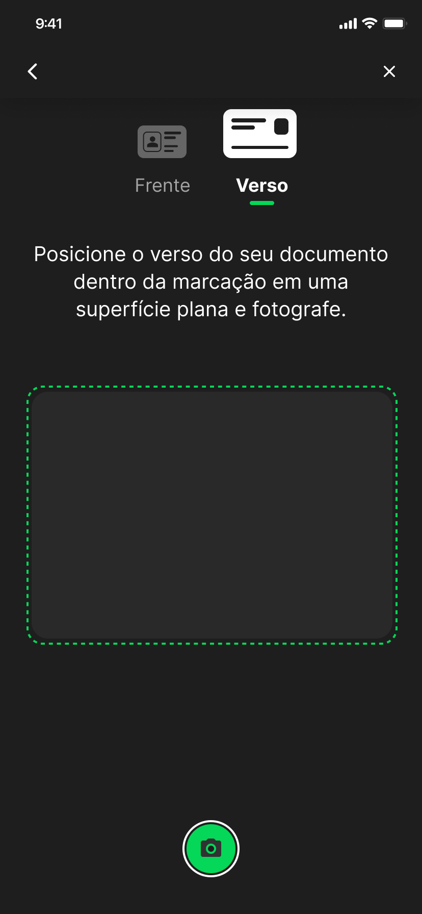

# Documentoscopia 
Saiba como implementar a customização de view (telas), conforme a sua necessidade.

Você pode utilizar o SDK padrão e por meio dele, também customizar a visualização dessas telas.

## Entenda como funciona

O **componente** de Documentoscopia **é dividido em treze telas**:

### 1. Tela inicial
O usuário define qual o tipo de documento que deseja enviar:

### 2. Tela de captura do documento (frente)
O usuário recebe a instrução de captura da frente do documento, dentro da marcação apresentada:

### 3. Abaixo, um exemplo de como esse documento deve ficar posicionado

### 4. Tela de confirmação da captura do documento (frente)
Nesta tela, o usuário deve confirmar se a imagem do documento capturado está em boa qualidade, clicando em Não, refazer ou Sim:

### 5. Tela de captura do documento (verso)
O usuário recebe a instrução de captura do verso do documento, dentro da marcação apresentada:

### 6. Abaixo, um exemplo de como esse documento deve ficar posicionado

### 7. Tela de confirmação da captura do documento (verso)
Nesta tela, o usuário deve confirmar se a imagem do documento capturado está em boa qualidade, clicando em Não, refazer ou Sim:

### 8. Tela de processamento do envio do documento
A próxima tela que o usuário deve ver é a tela de processamento do envio do documento:

### 9. Tela de conclusão do envio do documento (sucesso)
O usuário receberá uma notificação de **sucesso** caso o envio do documento seja concluído com sucesso:

### 10. Tela de processamento do documento (erro)
O usuário receberá uma notificação de erro ao processar o documento:

### 11. Tela para tentar processar o documento novamente (erro)
Nesta tela o usuário poderá clicar no botão **Tentar novamente**, após a mensagem de erro:

### 12. Tela com mensagem do Android para  direcionar o usuário a tela de configuração

**Obs.:** Por padrão, o Android apresenta essa mensagem de configuração apenas uma vez. As próximas vezes o usuário terá que ir até a tela de configurações para dar permissão para a câmera manualmente.

### 14. Tela de instrução para habilitar câmera:
Caso a solicitação seja recusada pelo usuário, neste passo é apresentado a mensagem para direciona-lo às configurações:

---

## Instalação e configuração das telas customizáveis

