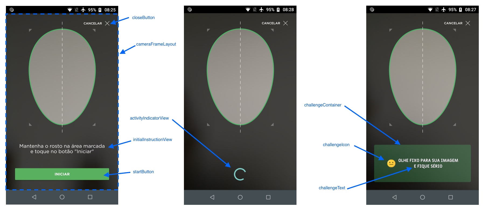

> 🚧 Este é um repositório legado. Como parte de nossos esforços, reorganizamos nossos recursos técnicos. 
**Para acessar as informações mais recentes visite o [novo repositório](https://github.com/oititec/android-oiti-versions).** 
Este repositório permancerá ativo, mas não receberá atualizações.

# Liveness - Guia de implementação de view customizada

A partir da versão 2.0.0, o SDK Liveness permite que a forma de visualização seja completamente customizada.

Para isso, é necessário criar um layout que será utilizado pelo fragment do SDK, e passá-lo para o Intent da `FaceCaptchaActivity`, através da chave `PARAM_OVERLAY_IMAGE`. Este fragment deve obrigatoriamente conter alguns elementos visuais com IDs pré-determinados, para o correto funcionamento do processo de desafios.

Caso este fragment não esteja em conformidade com as especificações, será retornado o erro `INVALID_CUSTOM_FRAGMENT` no `onActivityResult` (através da chave `FaceCaptchaActivity.PARAM_RESULT_ERROR`). Para saber mais detalhes sobre a causa do erro, é possível verificar o valor retornado em `FaceCaptchaActivity.PARAM_RESULT_ERROR`.

O layout fornecido deve conter as seguintes views:

|Classe|id|Obrigatória|Descrição|
|------|--|-----------|---------|
|FrameLayout|cameraFrameLayout|Sim|Nesta view será colocado o preview da câmera.|
|View|startButton|Sim|Botão para iniciar o desafio.|
|View|closeButton|Sim|Botão para interromper e fechar o desafio.|
|ImageView|challengeIcon|Sim|ImageView que exibirá o ícone do desafio.|
|ImageView|challengeText|Sim|ImageView que exibirá o texto do desafio.|
|View|activityIndicatorView|Sim|View que será exibida em momentos de carregamento e validação.|
|ViewGroup|challengeContainer|Não|View usada como container de challengeIcon e challengeText.|
|View|initialInstructionView|Não|View que será mostrada inicialmente, e desaparece após startButton ser clicado.|

OBS: As subviews podem ser de classes que extendam as classes descritas na tabela acima. Por exemplo, startButton pode ser da classe Button.

Além das subviews especificadas, a view customizada pode conter outros elementos, apenas tomando cuidado para que os mesmos não interfiram nas subviews funcionais.

Na figura abaixo é possível visualizar o que cada uma das subviews representa na tela:



Após criado o layout, é necessário passá-lo para o Intent da `FaceCaptchaActivity`, através da chave `PARAM_CUSTOM_FRAGMENT`. Exemplo:

```kotlin
val intent = Intent(this, FaceCaptchaActivity::class.java).apply {
    putExtra(FaceCaptchaActivity.PARAM_ENDPOINT, ENDPOINT)
    putExtra(FaceCaptchaActivity.PARAM_USER_DATA, userData)
    putExtra(FaceCaptchaActivity.PARAM_DEBUG_ON, false) // Passar true para mostrar logs na tela
    putExtra(FaceCaptchaActivity.PARAM_CUSTOM_FRAGMENT, R.layout.fragment_custom)
}
```

No projeto Sample, neste mesmo repositório, encontra-se um exemplo de implementação.
